# Classifying Leukocyte (White Blood Cell) Images with Deep Learning

This is a model training pipeline which includes a CLI to run local inference to classify microscopic white blood cell images. It was based on the ResNet family of models (18, 34, 50), which I fine-tuned with 16633 expert-labeled microscopic images of basophils, neutrophils, monocytes, eosinophils, and lymphocytes. 

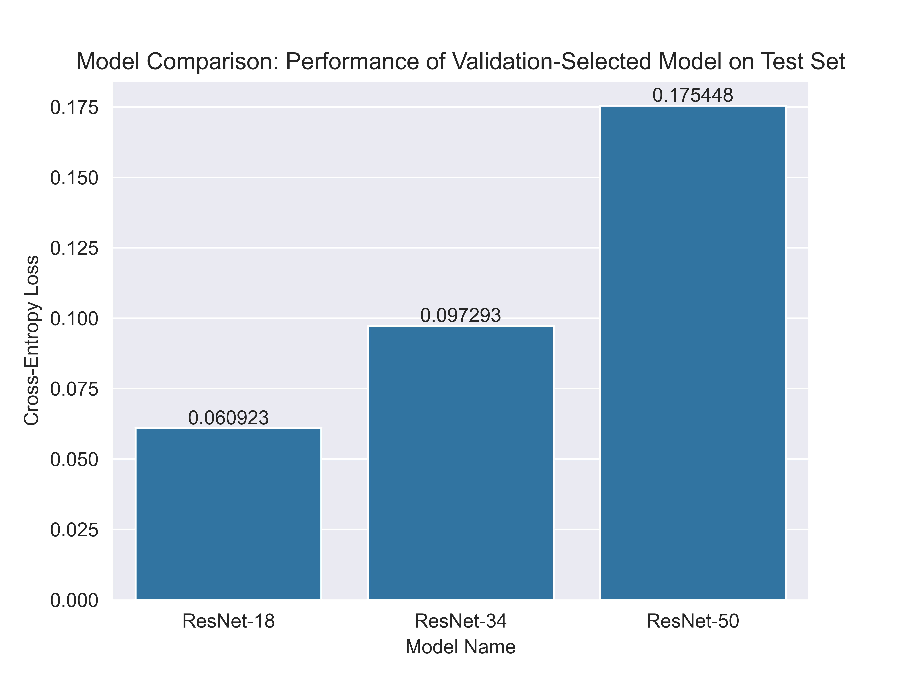

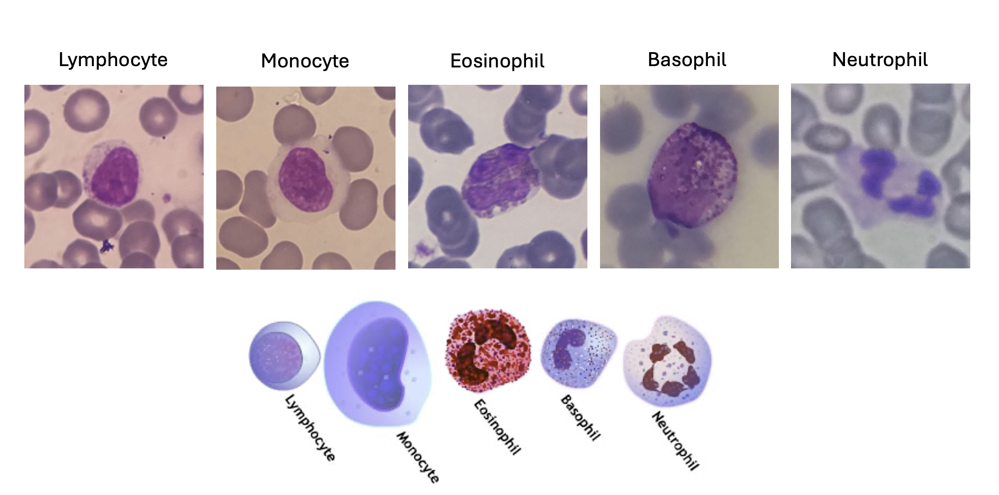


## Environment Setup

I managed my dependencies with uv. [View the instructions to install uv](https://docs.astral.sh/uv/getting-started/installation/) if you don't have it on your system.

To build a suitable virtual environment, run:

```bash
uv sync
```

## The Data

The data include 16,633 expert-labelled microscopic images fo white blood cells, which are provided by [RaabinData](https://raabindata.com/).

To download all 16,633 images, run:

```bash
uv run python download_data.py
```

## Train the Model

You can reproduce my model by re-running my entire training pipeline with:

```bash
uv run python train.py --use_gpu --weight_loss --save_test_predictions_and_labels
```

For info on all command line arguments, run:

```bash
uv run python train.py --help
```

## Plot and Analyze Training Results

To plot and analyze the results of model training, use:

```bash
uv run python analysis/train_analysis.py --model_result_dir ... --model_name ...
```

And pass the name of the model result directory containing the outputs of `train.py`.


## To Run Inference on New Images:

To start my CLI for running inference on new images, run:

```bash
uv run python predict.py --model_path sample/resnet18_epoch_10.pt --model_name ResNet-18 --use_gpu
```

(I've included my trained ResNet-18 model in this repo)

You can pass `sample/random_eosinophil_image.jpg` to make a prediction, and should get something like the following result:

```
Predicted class: Eosinophil

Predicted probabilities:
        Basophil: 0.0000
        Neutrophil: 0.0000
        Monocyte: 0.0000
        Eosinophil: 1.0000
        Lymphocyte: 0.0000

Prediction time: 0.2098 seconds
```

## My Training Results

### ResNet-18

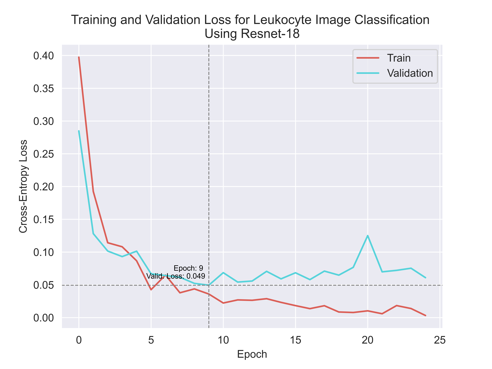
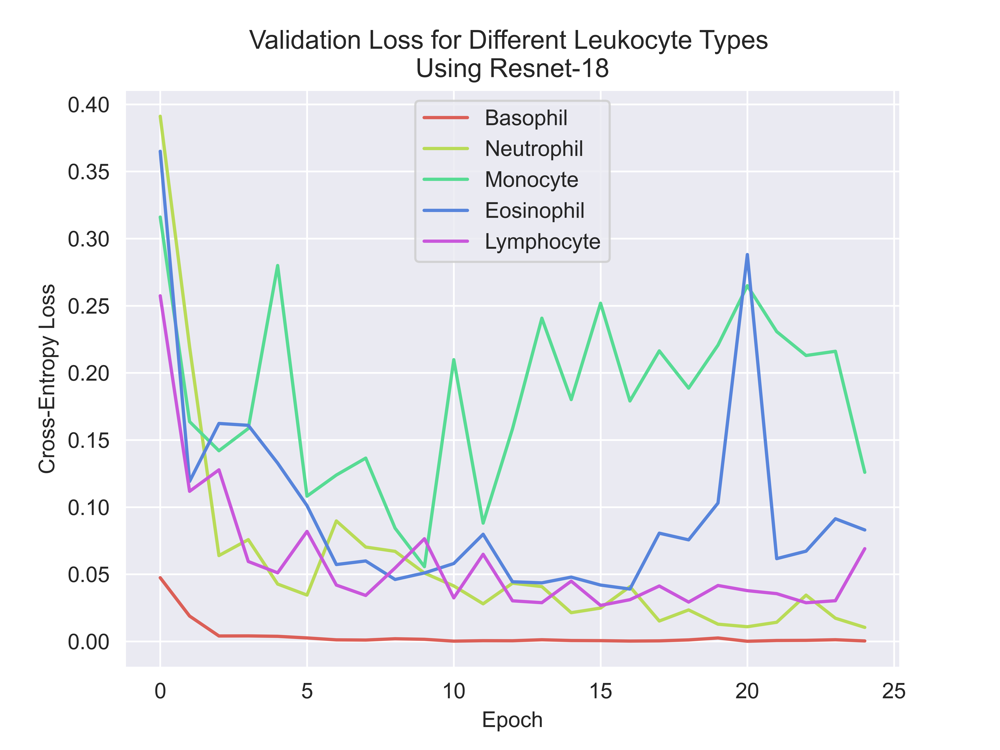
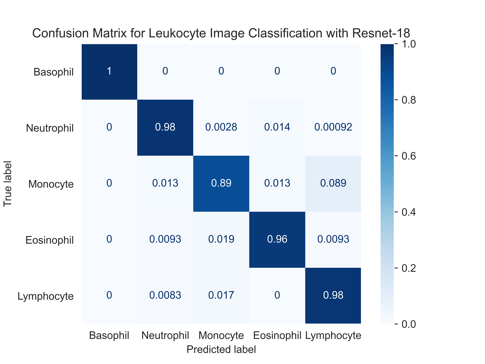

### ResNet-34

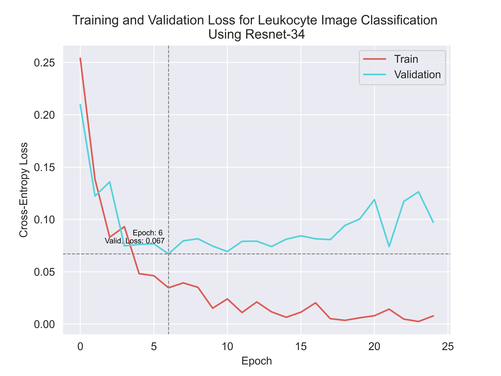
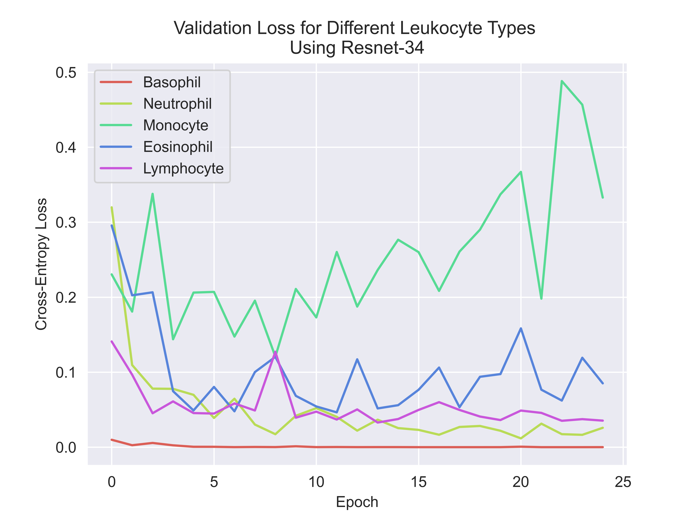
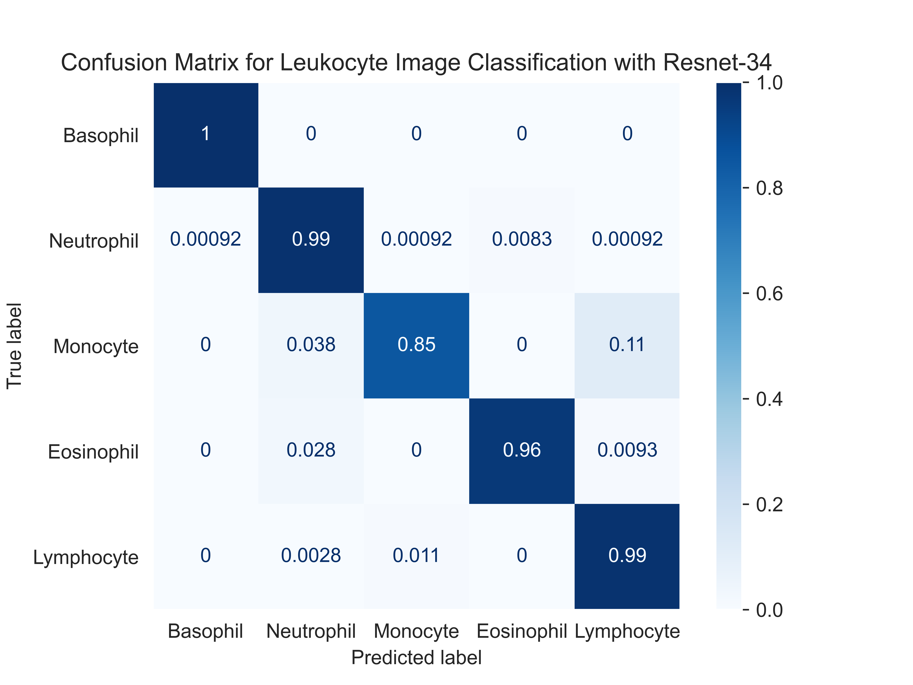

### ResNet-50

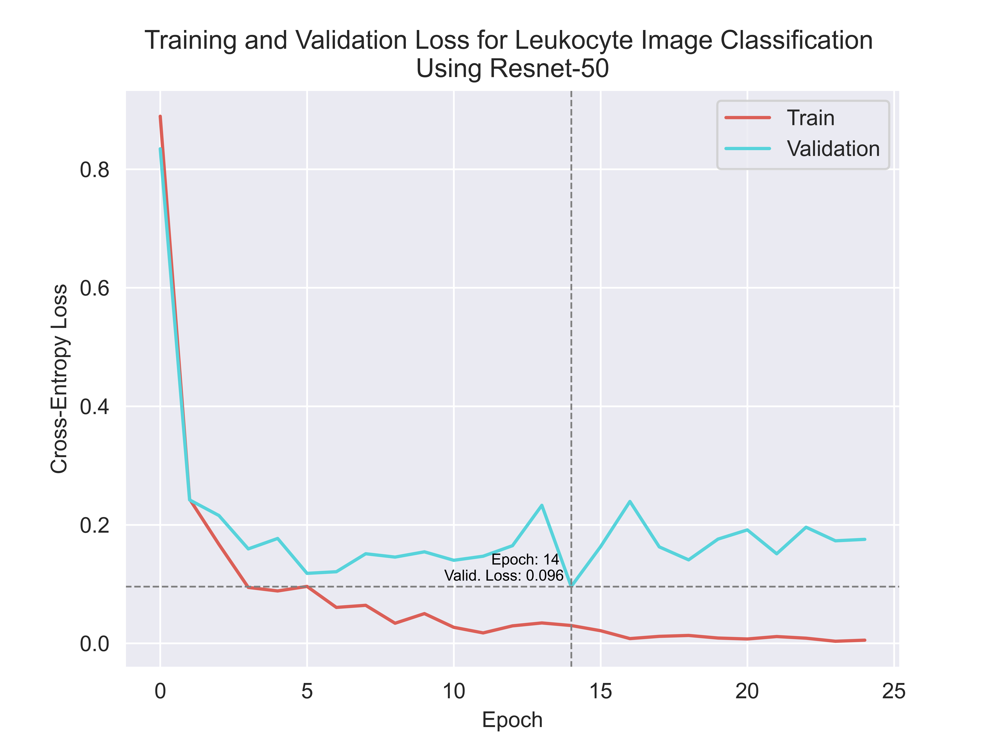
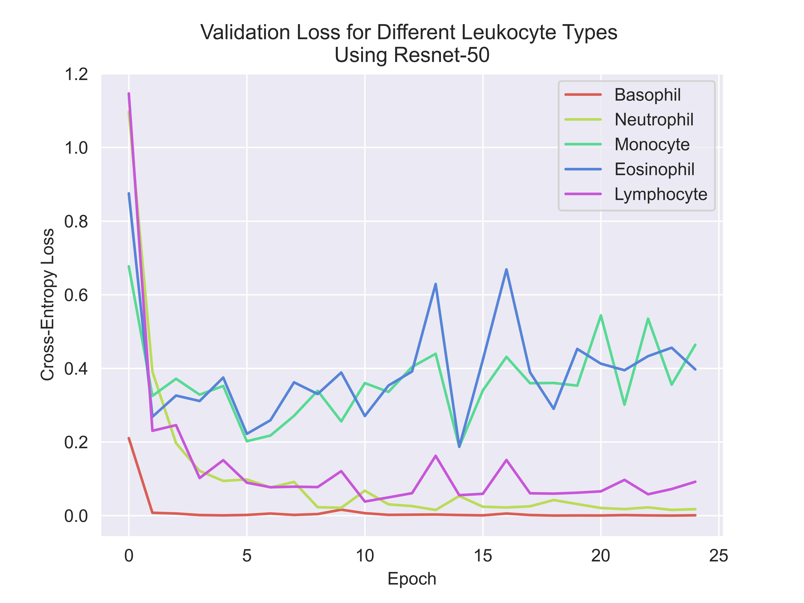
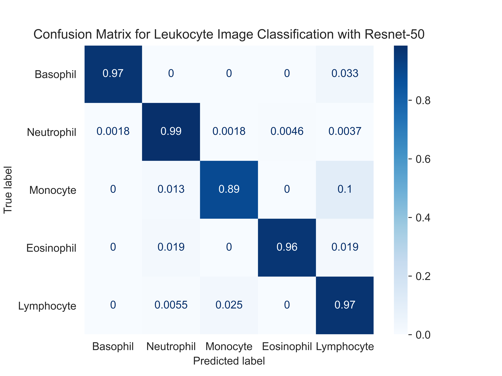


